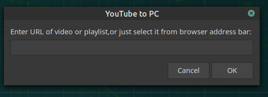

# YouTube to PC

A simple bash script to download video or audio from YouTube. 

It uses the powerful and notorious **youtube-dl** to download from youtube and other sites, giving the user the opportunity to select the format of the file, audio or video.
## USE INSTRUCTIONS

* **COPY**, or just **SELECT** the url of the **video** or the **playlist** that you want to download:

If you open the application without having copied or selected  a video url, you will be prompted to add the url of the video you want to download:

* The application next will prompt you to confirm that the video title that you want to download is the one that is presented:

* Next, the application will ask you to select the format of the outout file:

* After that, the download begins, and it is shown with a progress bar:

* When the work is complete, a final message will let you know:

## IMPORTANT DEPENDENCY

* The most important depedency is **<u>youtube-dl</u>**

The instuctions for dowloading youtube-dl (as they are found [here](https://github.com/ytdl-org/youtube-dl)) are the folllowing:

----

----
> 
>To install it right away for all UNIX users (Linux, macOS, etc.), type:

>    sudo curl -L https://yt-dl.org/downloads/latest/youtube-dl -o /usr/local/bin/youtube-dl
>   sudo chmod a+rx /usr/local/bin/youtube-dl

>If you do not have curl, you can alternatively use a recent wget:

>   sudo wget https://yt-dl.org/downloads/latest/youtube-dl -O /usr/local/bin/youtube-dl
 >   sudo chmod a+rx /usr/local/bin/youtube-dl

>You can also use pip:

>    sudo -H pip install --upgrade youtube-dl
    
>This command will update youtube-dl if you have already installed it. See the [pypi page](https://pypi.python.org/pypi/youtube_dl) for more information.

> Alternatively, refer to the [developer instructions](#developer-instructions) for how to check out and work with the git repository. For further options, including PGP signatures, see the [youtube-dl Download Page](https://ytdl-org.github.io/youtube-dl/download.html).

---

---

## OTHER DEPENDENCIES

Other dependencies include xclip and zenity:

    sudo apt install xclip zenity
    
## INSTALL 

* Change directory to yt2pc/

    cd yt2pc

* Make YouTube2pc executable:

    chmod +x YouTube2pc

## RUN

Run YouTube2pc:

    ./YouTube2pc

